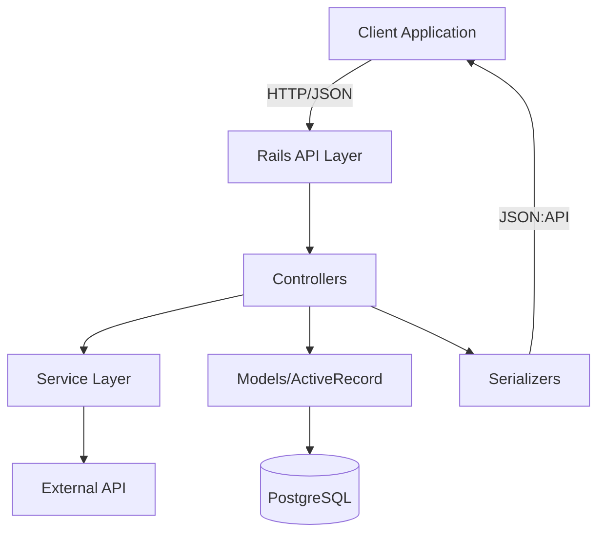
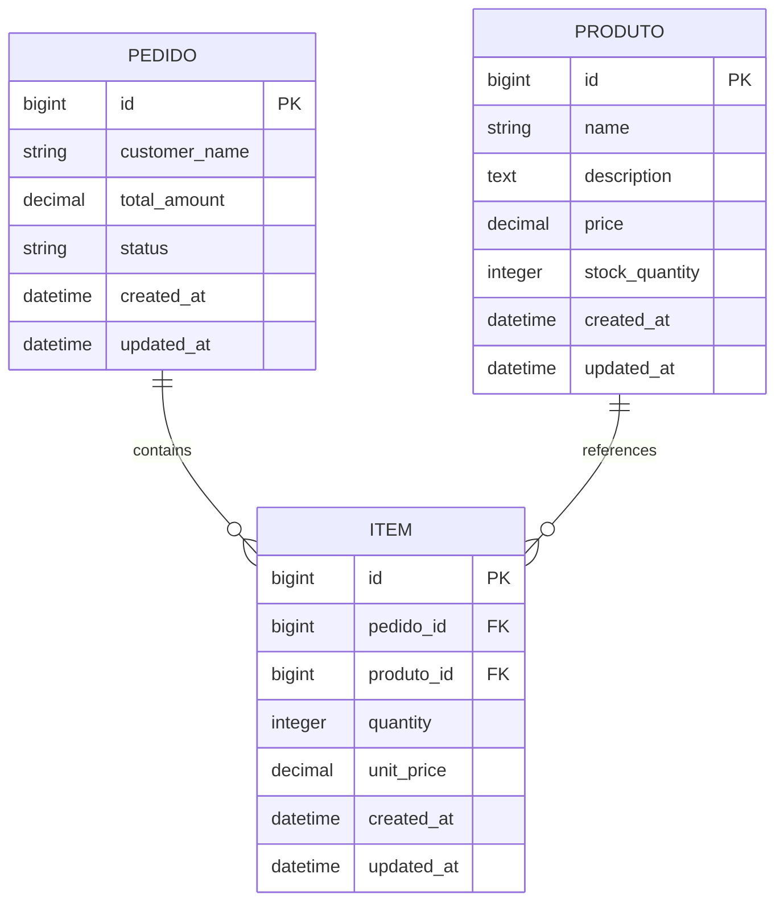
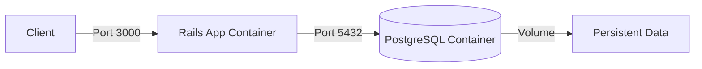

# Design Document - minha_loja_api

## Overview

O **minha_loja_api** é um microservice RESTful construído em Ruby on Rails (modo API-only) que gerencia produtos e pedidos de uma loja virtual. O sistema implementa padrões modernos de design de API, incluindo versionamento, serialização JSON:API, e integração resiliente com serviços externos.

### Key Design Principles

- **API-First Design**: Otimizado para consumo por SPAs, aplicações mobile e outros microservices
- **Resilience**: Tratamento robusto de falhas em integrações externas
- **Consistency**: Respostas JSON padronizadas seguindo JSON:API specification
- **Versioning**: Suporte a evolução da API sem quebrar clientes existentes

## Architecture

### High-Level Architecture



### Technology Stack

- **Framework**: Ruby on Rails 7.x (API mode)
- **Database**: PostgreSQL
- **HTTP Client**: Faraday (for external API integration)
- **Serialization**: jsonapi-serializer gem
- **Documentation**: rswag (OpenAPI/Swagger)
- **Testing**: RSpec, FactoryBot

### Project Structure

```
minha_loja_api/
├── app/
│   ├── controllers/
│   │   └── api/
│   │       └── v1/
│   │           ├── produtos_controller.rb
│   │           ├── pedidos_controller.rb
│   │           └── enderecos_controller.rb (or cambio_controller.rb)
│   ├── models/
│   │   ├── produto.rb
│   │   ├── pedido.rb
│   │   └── item.rb
│   ├── serializers/
│   │   ├── produto_serializer.rb
│   │   ├── pedido_serializer.rb
│   │   └── item_serializer.rb
│   └── services/
│       └── external_api_service.rb
├── config/
│   └── routes.rb
├── db/
│   └── migrate/
└── spec/
```

## Components and Interfaces

### 1. API Routing Layer

**Namespace Strategy**: All endpoints under `/api/v1`

```ruby
# config/routes.rb
Rails.application.routes.draw do
  namespace :api do
    namespace :v1 do
      resources :produtos
      resources :pedidos
      get 'enderecos/:cep', to: 'enderecos#show'  # or cambio endpoint
    end
  end
end
```

**Design Decision**: Route-based versioning allows independent evolution of API versions and clear separation of concerns.

### 2. Controllers

#### Base API Controller

```ruby
# app/controllers/api/v1/base_controller.rb
module Api
  module V1
    class BaseController < ApplicationController
      rescue_from ActiveRecord::RecordNotFound, with: :not_found
      rescue_from ActiveRecord::RecordInvalid, with: :unprocessable_entity
      
      private
      
      def not_found(exception)
        render json: { error: exception.message }, status: :not_found
      end
      
      def unprocessable_entity(exception)
        render json: { errors: exception.record.errors }, status: :unprocessable_entity
      end
    end
  end
end
```

#### Produtos Controller

**Responsibilities**:
- Handle CRUD operations for products
- Delegate serialization to ProdutoSerializer
- Return appropriate HTTP status codes

**Key Methods**:
- `index`: List all products (GET /api/v1/produtos)
- `show`: Get single product (GET /api/v1/produtos/:id)
- `create`: Create new product (POST /api/v1/produtos)
- `update`: Update product (PATCH /api/v1/produtos/:id)
- `destroy`: Delete product (DELETE /api/v1/produtos/:id)

#### Pedidos Controller

**Responsibilities**:
- Handle CRUD operations for orders
- Support nested attributes for items
- Include items in serialized response

**Key Methods**: Same as Produtos, with nested items support

#### External API Controller (Enderecos or Cambio)

**Responsibilities**:
- Validate input parameters
- Delegate external API calls to service layer
- Handle service failures gracefully
- Return fallback data when external service is unavailable

### 3. Service Layer

#### ExternalApiService

**Purpose**: Encapsulate all external API communication with resilience patterns

**Key Features**:
- Configurable timeouts
- Automatic retries with exponential backoff
- Fallback responses
- Comprehensive error logging

**Implementation Pattern**:

```ruby
class ExternalApiService
  OPEN_TIMEOUT = 5  # seconds
  READ_TIMEOUT = 10 # seconds
  MAX_RETRIES = 3
  
  def initialize
    @connection = Faraday.new do |conn|
      conn.options.open_timeout = OPEN_TIMEOUT
      conn.options.timeout = READ_TIMEOUT
      conn.adapter Faraday.default_adapter
    end
  end
  
  def fetch_with_resilience(url)
    attempt = 0
    begin
      attempt += 1
      response = @connection.get(url)
      parse_response(response)
    rescue Faraday::TimeoutError, Faraday::ConnectionFailed => e
      if attempt < MAX_RETRIES
        sleep(backoff_time(attempt))
        retry
      else
        log_failure(e, url)
        fallback_response
      end
    end
  end
  
  private
  
  def backoff_time(attempt)
    2 ** attempt  # Exponential: 2s, 4s, 8s
  end
  
  def fallback_response
    # Return safe default data
  end
end
```

**Design Rationale**:
- **Timeouts**: Prevent indefinite waiting on slow services
- **Exponential Backoff**: Reduces load on failing services, increases success probability
- **Fallback**: Ensures API always returns 200 with useful data instead of 500 errors

## Data Models

### Entity Relationship Diagram



### Model Specifications

#### Produto Model

```ruby
class Produto < ApplicationRecord
  has_many :itens
  
  validates :name, presence: true
  validates :price, presence: true, numericality: { greater_than: 0 }
  validates :stock_quantity, presence: true, numericality: { 
    only_integer: true, 
    greater_than_or_equal_to: 0 
  }
end
```

**Attributes**:
- `name` (string, required): Product name
- `description` (text, optional): Product description
- `price` (decimal, required): Product price (must be positive)
- `stock_quantity` (integer, required): Available stock (non-negative)

#### Pedido Model

```ruby
class Pedido < ApplicationRecord
  has_many :itens, dependent: :destroy
  accepts_nested_attributes_for :itens
  
  validates :customer_name, presence: true
  validates :total_amount, presence: true, numericality: { greater_than: 0 }
  validates :status, presence: true, inclusion: { 
    in: %w[pending confirmed shipped delivered cancelled] 
  }
  
  before_validation :calculate_total_amount
  
  private
  
  def calculate_total_amount
    self.total_amount = itens.sum { |item| item.quantity * item.unit_price }
  end
end
```

**Attributes**:
- `customer_name` (string, required): Customer name
- `total_amount` (decimal, required): Order total (calculated from items)
- `status` (string, required): Order status (enum-like validation)

#### Item Model

```ruby
class Item < ApplicationRecord
  belongs_to :pedido
  belongs_to :produto
  
  validates :quantity, presence: true, numericality: { 
    only_integer: true, 
    greater_than: 0 
  }
  validates :unit_price, presence: true, numericality: { greater_than: 0 }
  validates :produto_id, presence: true
end
```

**Attributes**:
- `pedido_id` (bigint, required): Foreign key to Pedido
- `produto_id` (bigint, required): Foreign key to Produto
- `quantity` (integer, required): Item quantity (positive)
- `unit_price` (decimal, required): Price per unit at time of order

### Database Migrations

**Migration Strategy**: Use Rails migrations with proper indexes for foreign keys and frequently queried fields.

```ruby
# db/migrate/xxx_create_produtos.rb
create_table :produtos do |t|
  t.string :name, null: false
  t.text :description
  t.decimal :price, precision: 10, scale: 2, null: false
  t.integer :stock_quantity, null: false, default: 0
  t.timestamps
end

add_index :produtos, :name
```

## Serialization Strategy

### JSON:API Format

Using `jsonapi-serializer` gem to ensure consistent, standardized responses.

#### ProdutoSerializer

```ruby
class ProdutoSerializer
  include JSONAPI::Serializer
  
  attributes :name, :description, :price, :stock_quantity
  
  # Exclude timestamps and internal IDs from response
end
```

**Sample Response**:
```json
{
  "data": {
    "id": "1",
    "type": "produto",
    "attributes": {
      "name": "Notebook",
      "description": "High-performance laptop",
      "price": "2999.99",
      "stock_quantity": 15
    }
  }
}
```

#### PedidoSerializer

```ruby
class PedidoSerializer
  include JSONAPI::Serializer
  
  attributes :customer_name, :total_amount, :status
  
  has_many :itens, serializer: ItemSerializer
end
```

**Sample Response**:
```json
{
  "data": {
    "id": "1",
    "type": "pedido",
    "attributes": {
      "customer_name": "João Silva",
      "total_amount": "3499.98",
      "status": "confirmed"
    },
    "relationships": {
      "itens": {
        "data": [
          { "id": "1", "type": "item" },
          { "id": "2", "type": "item" }
        ]
      }
    }
  },
  "included": [
    {
      "id": "1",
      "type": "item",
      "attributes": {
        "quantity": 1,
        "unit_price": "2999.99"
      }
    }
  ]
}
```

**Design Benefits**:
- Consistent structure across all endpoints
- Clear separation of attributes and relationships
- Efficient inclusion of related resources
- Easy to extend without breaking existing clients

## Error Handling

### Error Response Format

All errors follow consistent JSON structure:

```json
{
  "error": "Resource not found",
  "status": 404
}
```

For validation errors:

```json
{
  "errors": {
    "name": ["can't be blank"],
    "price": ["must be greater than 0"]
  },
  "status": 422
}
```

### HTTP Status Codes

- `200 OK`: Successful GET, PATCH, DELETE
- `201 Created`: Successful POST
- `204 No Content`: Successful DELETE (alternative)
- `400 Bad Request`: Invalid request format
- `404 Not Found`: Resource doesn't exist
- `422 Unprocessable Entity`: Validation errors
- `500 Internal Server Error`: Unexpected errors (should be rare)

### External API Error Handling

**Strategy**: Never propagate external service failures as 500 errors

```ruby
def show
  cep = params[:cep]
  
  result = ExternalApiService.new.fetch_cep(cep)
  
  if result[:success]
    render json: result[:data], status: :ok
  else
    # Return fallback with 200 status
    render json: { 
      cep: cep, 
      logradouro: "Informação temporariamente indisponível",
      fallback: true 
    }, status: :ok
  end
end
```

## External API Integration

### CEP Integration Example (ViaCEP)

**Endpoint**: `GET /api/v1/enderecos/:cep`

**External Service**: https://viacep.com.br/ws/{cep}/json/

**Implementation**:

```ruby
class CepService < ExternalApiService
  BASE_URL = 'https://viacep.com.br/ws'
  
  def fetch_cep(cep)
    url = "#{BASE_URL}/#{sanitize_cep(cep)}/json/"
    fetch_with_resilience(url)
  end
  
  private
  
  def sanitize_cep(cep)
    cep.to_s.gsub(/\D/, '')
  end
  
  def fallback_response
    {
      success: false,
      data: {
        cep: nil,
        logradouro: "Serviço temporariamente indisponível",
        fallback: true
      }
    }
  end
end
```

**Resilience Features**:
- Input sanitization (remove non-digits)
- 5s open timeout, 10s read timeout
- 3 retry attempts with exponential backoff (2s, 4s, 8s)
- Fallback response with friendly message
- Comprehensive logging of failures

### Alternative: Currency Exchange Integration

**Endpoint**: `GET /api/v1/cambio/:moeda`

**External Service**: https://api.exchangerate-api.com/v4/latest/BRL

Similar implementation pattern with appropriate fallback data.

## Testing Strategy

### Test Pyramid

```
    /\
   /  \  E2E Tests (Request Specs)
  /____\
 /      \ Integration Tests (Service Specs)
/________\ Unit Tests (Model/Serializer Specs)
```

### Test Coverage Areas

#### 1. Model Tests (Unit)

```ruby
RSpec.describe Produto, type: :model do
  describe 'validations' do
    it { should validate_presence_of(:name) }
    it { should validate_numericality_of(:price).is_greater_than(0) }
    it { should validate_numericality_of(:stock_quantity).is_greater_than_or_equal_to(0) }
  end
  
  describe 'associations' do
    it { should have_many(:itens) }
  end
end
```

#### 2. Serializer Tests (Unit)

```ruby
RSpec.describe ProdutoSerializer do
  let(:produto) { create(:produto) }
  let(:serializer) { described_class.new(produto) }
  let(:serialization) { JSON.parse(serializer.to_json) }
  
  it 'includes expected attributes' do
    expect(serialization['data']['attributes']).to include(
      'name', 'description', 'price', 'stock_quantity'
    )
  end
  
  it 'excludes timestamps' do
    expect(serialization['data']['attributes']).not_to include('created_at', 'updated_at')
  end
end
```

#### 3. Controller Tests (Request Specs)

```ruby
RSpec.describe 'Api::V1::Produtos', type: :request do
  describe 'GET /api/v1/produtos' do
    it 'returns all produtos' do
      create_list(:produto, 3)
      
      get '/api/v1/produtos'
      
      expect(response).to have_http_status(:ok)
      expect(JSON.parse(response.body)['data'].size).to eq(3)
    end
  end
  
  describe 'POST /api/v1/produtos' do
    context 'with valid parameters' do
      let(:valid_params) do
        { produto: { name: 'Test', price: 10.0, stock_quantity: 5 } }
      end
      
      it 'creates a new produto' do
        expect {
          post '/api/v1/produtos', params: valid_params
        }.to change(Produto, :count).by(1)
        
        expect(response).to have_http_status(:created)
      end
    end
    
    context 'with invalid parameters' do
      let(:invalid_params) do
        { produto: { name: '', price: -10 } }
      end
      
      it 'returns validation errors' do
        post '/api/v1/produtos', params: invalid_params
        
        expect(response).to have_http_status(:unprocessable_entity)
        expect(JSON.parse(response.body)).to have_key('errors')
      end
    end
  end
end
```

#### 4. Service Tests (Integration)

```ruby
RSpec.describe CepService do
  describe '#fetch_cep' do
    context 'when external API is available' do
      before do
        stub_request(:get, "https://viacep.com.br/ws/01310100/json/")
          .to_return(status: 200, body: { cep: '01310-100' }.to_json)
      end
      
      it 'returns CEP data' do
        result = described_class.new.fetch_cep('01310-100')
        expect(result[:success]).to be true
      end
    end
    
    context 'when external API times out' do
      before do
        stub_request(:get, "https://viacep.com.br/ws/01310100/json/")
          .to_timeout
      end
      
      it 'returns fallback response after retries' do
        result = described_class.new.fetch_cep('01310-100')
        expect(result[:success]).to be false
        expect(result[:data][:fallback]).to be true
      end
    end
  end
end
```

### Test Tools

- **RSpec**: Test framework
- **FactoryBot**: Test data generation
- **WebMock**: HTTP request stubbing for external API tests
- **Shoulda Matchers**: Simplified validation/association testing
- **SimpleCov**: Code coverage reporting

## API Documentation

### OpenAPI/Swagger Integration

Using `rswag` gem to generate interactive API documentation.

**Setup**:
```ruby
# spec/swagger_helper.rb
RSpec.configure do |config|
  config.swagger_root = Rails.root.join('swagger').to_s
  
  config.swagger_docs = {
    'v1/swagger.yaml' => {
      openapi: '3.0.1',
      info: {
        title: 'Minha Loja API V1',
        version: 'v1',
        description: 'API RESTful para gerenciamento de produtos e pedidos'
      },
      paths: {},
      servers: [
        {
          url: 'http://localhost:3000',
          description: 'Development server'
        }
      ]
    }
  }
end
```

**Documentation Example**:
```ruby
# spec/requests/api/v1/produtos_spec.rb
describe 'Produtos API' do
  path '/api/v1/produtos' do
    get 'Lista todos os produtos' do
      tags 'Produtos'
      produces 'application/json'
      
      response '200', 'produtos encontrados' do
        schema type: :object,
          properties: {
            data: {
              type: :array,
              items: {
                type: :object,
                properties: {
                  id: { type: :string },
                  type: { type: :string },
                  attributes: {
                    type: :object,
                    properties: {
                      name: { type: :string },
                      price: { type: :string },
                      stock_quantity: { type: :integer }
                    }
                  }
                }
              }
            }
          }
        
        run_test!
      end
    end
  end
end
```

**Access**: Documentation available at `/api-docs` endpoint

## Security Considerations

### Input Validation

- All user inputs sanitized through strong parameters
- CEP format validation before external API calls
- SQL injection prevention through ActiveRecord parameterization

### Data Exposure

- Serializers explicitly define exposed attributes
- Timestamps and internal IDs excluded from responses
- No sensitive data in error messages

### Rate Limiting (Future Enhancement)

Consider implementing `rack-attack` gem for:
- Request throttling per IP
- Protection against brute force attacks
- API key-based rate limiting

## Performance Considerations

### Database Optimization

- Indexes on foreign keys (pedido_id, produto_id)
- Index on frequently queried fields (produto.name)
- Use of `includes` to prevent N+1 queries when loading pedidos with itens

### Caching Strategy (Optional Enhancement)

```ruby
# Cache produto list for 5 minutes
def index
  @produtos = Rails.cache.fetch('produtos/all', expires_in: 5.minutes) do
    Produto.all
  end
  render json: ProdutoSerializer.new(@produtos)
end
```

**Cache Invalidation**:
```ruby
after_save :clear_cache
after_destroy :clear_cache

def clear_cache
  Rails.cache.delete('produtos/all')
end
```

## Docker Containerization

### Container Architecture



### Dockerfile

**Multi-stage build strategy** for optimized image size:

```dockerfile
FROM ruby:3.2-alpine AS builder

# Install build dependencies
RUN apk add --no-cache build-base postgresql-dev tzdata

WORKDIR /app

# Install gems
COPY Gemfile Gemfile.lock ./
RUN bundle config set --local deployment 'true' && \
    bundle config set --local without 'development test' && \
    bundle install -j4

# Final stage
FROM ruby:3.2-alpine

# Install runtime dependencies
RUN apk add --no-cache postgresql-client tzdata

WORKDIR /app

# Copy gems from builder
COPY --from=builder /usr/local/bundle /usr/local/bundle

# Copy application code
COPY . .

# Expose port
EXPOSE 3000

# Start server
CMD ["rails", "server", "-b", "0.0.0.0"]
```

**Design Decisions**:
- **Alpine Linux**: Smaller image size (~50MB vs ~300MB)
- **Multi-stage build**: Separates build dependencies from runtime
- **Layer caching**: Gemfile copied before app code for better cache utilization
- **Non-root user**: Security best practice (can be added)

### Docker Compose Configuration

```yaml
version: '3.8'

services:
  db:
    image: postgres:15-alpine
    environment:
      POSTGRES_USER: postgres
      POSTGRES_PASSWORD: postgres
      POSTGRES_DB: minha_loja_api_development
    volumes:
      - postgres_data:/var/lib/postgresql/data
    ports:
      - "5432:5432"
    healthcheck:
      test: ["CMD-SHELL", "pg_isready -U postgres"]
      interval: 10s
      timeout: 5s
      retries: 5

  web:
    build: .
    command: bash -c "rm -f tmp/pids/server.pid && bundle exec rails db:prepare && bundle exec rails server -b 0.0.0.0"
    volumes:
      - .:/app
      - bundle_cache:/usr/local/bundle
    ports:
      - "3000:3000"
    environment:
      DATABASE_URL: postgresql://postgres:postgres@db:5432/minha_loja_api_development
      RAILS_ENV: development
      RAILS_LOG_TO_STDOUT: 'true'
    depends_on:
      db:
        condition: service_healthy

volumes:
  postgres_data:
  bundle_cache:
```

**Key Features**:
- **Health checks**: Ensures database is ready before starting app
- **Volume mounts**: 
  - Source code mounted for live reloading in development
  - Bundle cache for faster rebuilds
  - PostgreSQL data persistence
- **Automatic migrations**: `db:prepare` runs on container start
- **Dependency management**: Web waits for healthy database

### Environment Configuration

**Development (.env.development)**:
```
DATABASE_URL=postgresql://postgres:postgres@db:5432/minha_loja_api_development
RAILS_ENV=development
RAILS_LOG_TO_STDOUT=true
```

**Production (.env.production)**:
```
DATABASE_URL=postgresql://user:password@db:5432/minha_loja_api_production
RAILS_ENV=production
SECRET_KEY_BASE=<generated_secret>
RAILS_SERVE_STATIC_FILES=true
RAILS_LOG_TO_STDOUT=true
```

### Docker Commands Reference

**Development Workflow**:
```bash
# Build and start containers
docker-compose up --build

# Run in detached mode
docker-compose up -d

# View logs
docker-compose logs -f web

# Run migrations
docker-compose exec web rails db:migrate

# Run console
docker-compose exec web rails console

# Run tests
docker-compose exec web rspec

# Stop containers
docker-compose down

# Stop and remove volumes
docker-compose down -v
```

**Production Build**:
```bash
# Build production image
docker build -t minha-loja-api:latest .

# Run with production env
docker run -p 3000:3000 \
  -e DATABASE_URL=postgresql://... \
  -e RAILS_ENV=production \
  -e SECRET_KEY_BASE=... \
  minha-loja-api:latest
```

### Container Optimization

**Image Size Optimization**:
- Use Alpine Linux base image
- Multi-stage builds to exclude build tools
- Remove unnecessary files (.git, spec, tmp)

**Performance Optimization**:
- Bundle cache volume for faster gem installation
- Precompile assets in production builds
- Use connection pooling for database

**Security Considerations**:
- Run as non-root user
- Use secrets management for sensitive data
- Scan images for vulnerabilities
- Keep base images updated

### Development vs Production

| Aspect | Development | Production |
|--------|-------------|------------|
| Base Image | ruby:3.2-alpine | ruby:3.2-alpine |
| Code Mount | Volume mounted | Copied into image |
| Gems | Installed on build | Bundled in image |
| Database | PostgreSQL container | External managed DB |
| Logs | STDOUT | STDOUT + external logging |
| Secrets | .env file | Environment variables |

## Deployment Considerations

### Cloud Deployment Options

**Docker-based platforms**:
- **AWS ECS/Fargate**: Managed container orchestration
- **Google Cloud Run**: Serverless containers
- **Heroku**: Container registry support
- **DigitalOcean App Platform**: Docker support

**Kubernetes Deployment**:
```yaml
apiVersion: apps/v1
kind: Deployment
metadata:
  name: minha-loja-api
spec:
  replicas: 3
  selector:
    matchLabels:
      app: minha-loja-api
  template:
    metadata:
      labels:
        app: minha-loja-api
    spec:
      containers:
      - name: web
        image: minha-loja-api:latest
        ports:
        - containerPort: 3000
        env:
        - name: DATABASE_URL
          valueFrom:
            secretKeyRef:
              name: db-secret
              key: url
```

## Future Enhancements

1. **Authentication/Authorization**: JWT-based authentication with role-based access control
2. **Pagination**: Implement pagination for list endpoints using `kaminari` or `pagy`
3. **Filtering**: Add query parameters for filtering produtos by price range, stock availability
4. **Webhooks**: Notify external systems when pedido status changes
5. **Async Processing**: Use Sidekiq for background jobs (e.g., sending order confirmation emails)
6. **Monitoring**: Integrate with New Relic or Datadog for performance monitoring
7. **API Analytics**: Track endpoint usage, response times, error rates

## Summary

This design provides a solid foundation for a production-ready Rails API with:
- Clean separation of concerns (MVC + Services)
- Resilient external integrations
- Consistent JSON:API responses
- Comprehensive error handling
- Testable architecture
- Clear documentation strategy

The implementation follows Rails conventions while incorporating modern API best practices for scalability, maintainability, and reliability.
